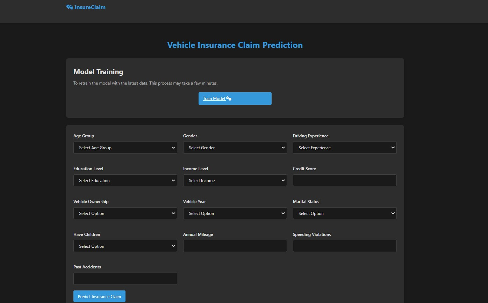
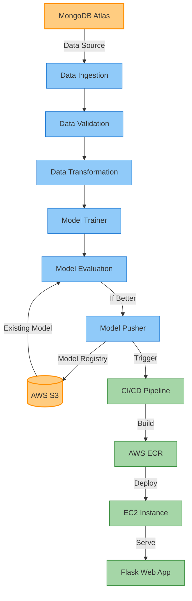

# MLOps - Vehicle Insurance Claim Prediction

This comprehensive, enterprise-grade MLOps project revolutionizes vehicle insurance claim prediction through a sophisticated machine learning pipeline with state-of-the-art automation. The solution orchestrates the entire ML lifecycle from data ingestion to model deployment, creating a seamless flow of operations that transforms raw insurance data into actionable predictions.

### Why This Matters

In the competitive insurance industry, accurately predicting vehicle insurance claims can:
- **Reduce Financial Risk** by identifying high-risk policies before approval
- **Optimize Premium Pricing** through data-driven risk assessment
- **Streamline Claims Processing** by prioritizing resources efficiently
- **Enhance Customer Experience** with fair, data-based decisions

### Technical Excellence

The solution stands out by implementing industry best practices in MLOps:

- **Cloud-First Architecture** leveraging AWS services for scalability and reliability
- **Containerization & Orchestration** ensuring consistent environments across all stages
- **Automated CI/CD Workflows** enabling rapid, reliable iterations and deployments
- **Advanced Model Monitoring** with performance tracking and drift detection
- **Data Validation & Governance** ensuring compliance and model reproducibility

The system integrates MongoDB Atlas for flexible data storage, AWS S3 for model registry, ECR for container management, and EC2 for production deployment, creating a robust, scalable infrastructure designed for enterprise-level performance.

## App Screenshot

<p align="center">
  
</p>

## Tech Stack

<p align="center">
  <b>Infrastructure & Deployment</b><br>
  
  
  
  
  
  <br><br>
  <b>Data & ML</b><br>
  
  
  
  
  
</p>

## MLOps Architecture



## Getting Started

### Prerequisites

- Python 3.10
- Git
- AWS Account
- MongoDB Atlas Account

### Installation

1. **Clone the repository**
   ```bash
   git clone https://github.com/yourusername/vehicle-insurance-claim-prediction.git
   cd vehicle-insurance-claim-prediction
   ```

2. **Set up virtual environment**
   ```bash
   # Using venv
   python -m venv venv
   source venv/bin/activate  # Linux/Mac
   venv\Scripts\activate     # Windows
   
   # Or using conda
   conda create -n venv python=3.10 -y
   conda activate venv
   
   # Install dependencies
   pip install -r requirements.txt
   ```

3. **Configure environment variables**
   
   Create a `.env` file or set environment variables:
   ```
   MONGODB_URL=mongodb+srv://<username>:<password>@cluster0.mongodb.net/?retryWrites=true&w=majority
   AWS_ACCESS_KEY_ID=your_access_key
   AWS_SECRET_ACCESS_KEY=your_secret_key
   AWS_DEFAULT_REGION=your_region
   ```

4. **Run the application locally**
   ```bash
   python app.py
   ```
   Access the web interface at `http://localhost:5000`

## ML Pipeline Components

### Data Pipeline
| Component | Description |
|-----------|-------------|
| **Data Ingestion** | Connects to MongoDB Atlas, extracts and splits insurance dataset into training and testing sets |
| **Data Validation** | Validates schema against predefined configuration, checks data quality and completeness |
| **Data Transformation** | Performs feature engineering, normalization, scaling, and preprocessing |

### Model Pipeline
| Component | Description |
|-----------|-------------|
| **Model Training** | Trains classification models with hyperparameter tuning and metrics calculation |
| **Model Evaluation** | Compares against previously deployed model using performance thresholds |
| **Model Pusher** | Uploads accepted models to S3 model registry and prepares for deployment |

## CI/CD Pipeline

Our MLOps solution uses GitHub Actions for continuous integration and deployment:

1. **Trigger**: Automatic workflow on push to main branch
2. **Build**: Docker image creation with all dependencies
3. **Push**: Automated upload to AWS ECR
4. **Deploy**: Seamless deployment to EC2 instance
5. **Monitor**: Self-hosted runner for enhanced security and performance

## Deployment

The application is automatically deployed to AWS EC2 and can be accessed via:
```
http://<ec2-public-ip>:5000
```

For manual model training, access:
```
http://<ec2-public-ip>:5000/train-view
```

## Security & Configuration

### MongoDB Atlas Setup
- Create a MongoDB Atlas cluster
- Configure database user with appropriate permissions
- Set up network access for application servers
- Use connection string in environment variables

### AWS Infrastructure
- IAM user with S3, ECR, and EC2 permissions
- S3 bucket configured for model versioning
- ECR repository for Docker image management
- EC2 instance with proper security groups

## Project Benefits

- **Reduced Time-to-Production**: Automated pipeline from model development to deployment
- **Consistent Model Quality**: Standardized evaluation ensures only high-performing models are deployed
- **Cost Efficiency**: Cloud resources optimized for performance and cost
- **Scalability**: Easily handle increased prediction loads with containerized deployment
- **Governance**: Complete model lineage tracking and versioning

## Thank You.

